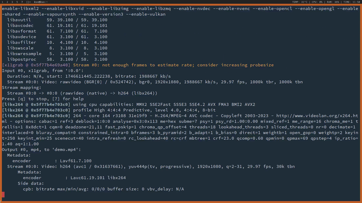
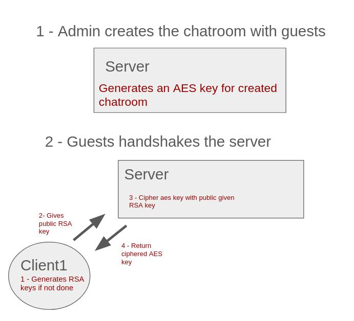
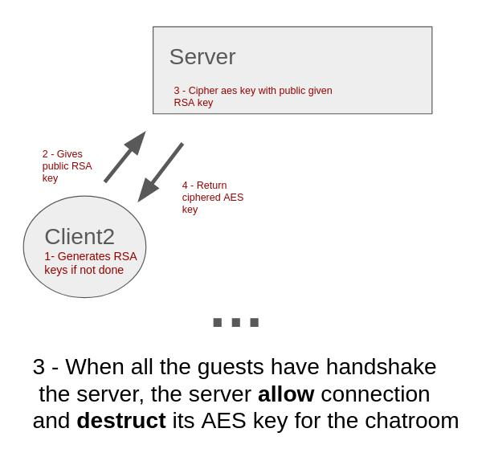

# InFoEnd



An end-to-end encrypted terminal chatroom application written in Go. 

## Explanation





## Setting up the server

With Mariadb

```
CREATE DATABSE InFoEnd
CREATE TABLE Status (name VARCHAR(15), authorized BOOL, aes_key VARCHAR(32))
```

## Create a chat room

```
server_dir $ go mod tidy
server_dir $ go build server.go
server_dir $ ./server
```

Now a terminal ui will appear

## Running the server

```
server_dir $ go build running_server.go
server_dir $ ./running_server
```

## Client Side

```
client_dir $ go mod tidy
client_dir $ go build client.go
client_dir $ echo "" > pubKey.pem
client_dir $ echo "" > privateKey.pem
client_dir $ mkdir my_rooms
client_dir $ ./client id@IP:port/chat_room
```

The client side terminal ui will appear if the informations provided are correct.

## Requirements

The clients and the server must share a `global_aes_key`


